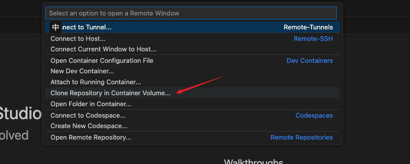
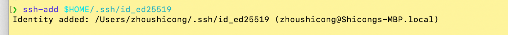

# Dev Container

## Clone repository in container

select "Clone Repository in Container Volume", it will save the repository in the container.



## Set SSH Agent

When using Mac OS, you can set it by following command.

```bash
ssh-add $HOME/.ssh/id_ed25519
```



You can see detail in [here](https://code.visualstudio.com/remote/advancedcontainers/sharing-git-credentials).
